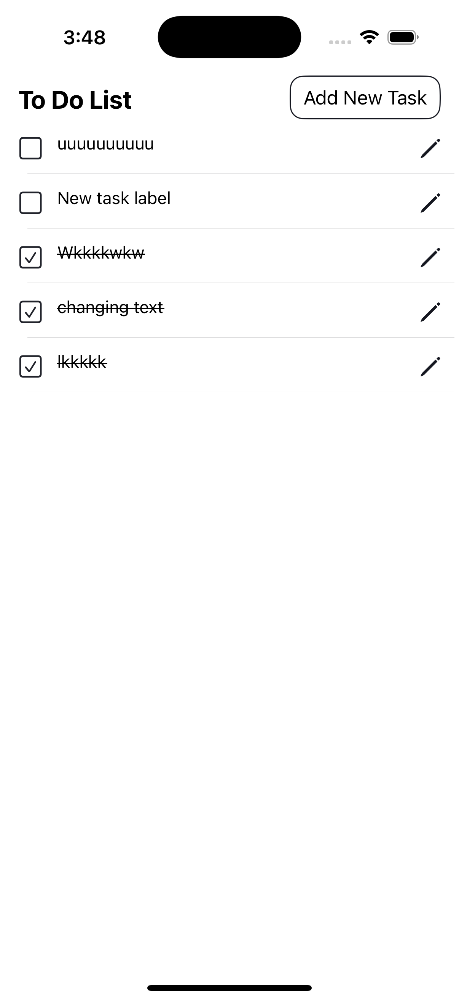
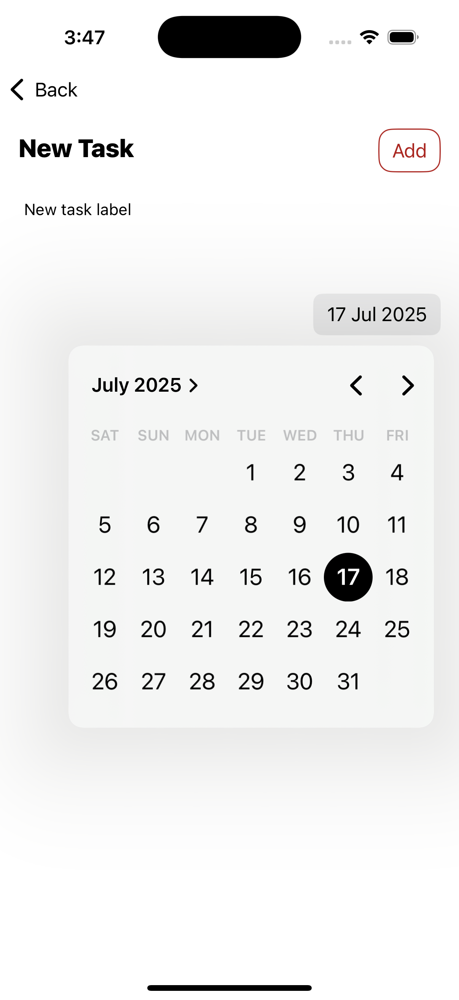
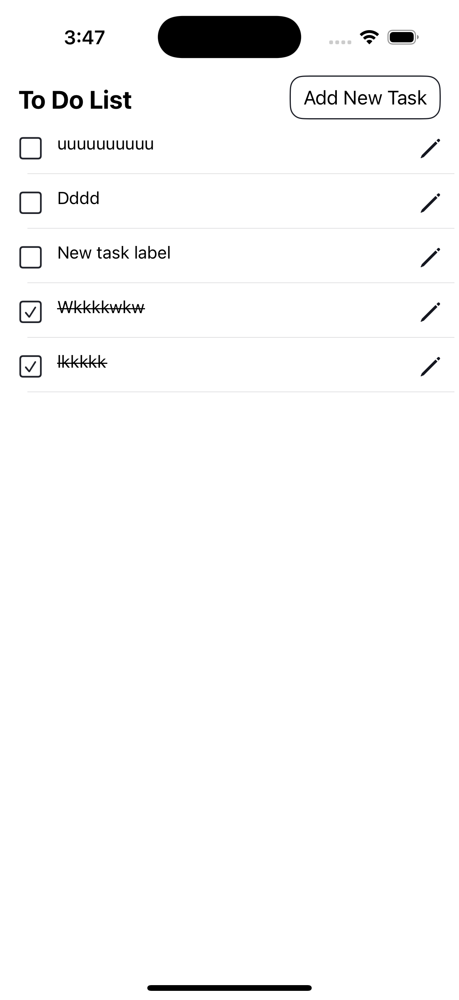
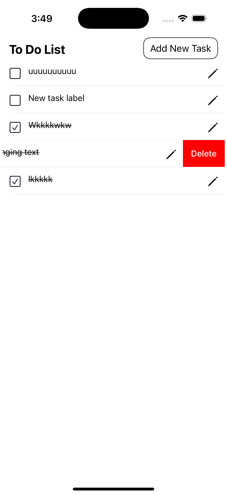
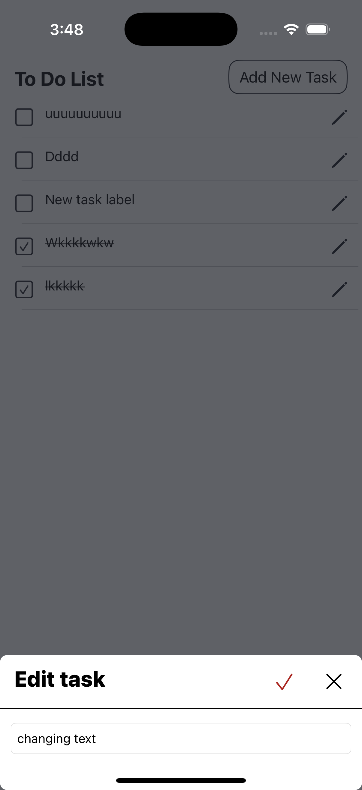

# To-Do List App (iOS)

A clean, minimal To-Do app built with **UIKit** that allows users to manage tasks sortied by deadline with features like adding, deleting, marking as complete, and local storage using **Core Data**.

---

## Features

- Add new tasks with title and deadline
- Mark tasks as complete/incomplete
- Swipe to delete 
- Tasks persist between sessions using **Core Data**
- Sort tasks by **nearest deadline**
- Completed tasks are styled with **strike-through**
- Built using clean MVVM architecture
- You can edit task label

---

## Tech Stack

- Swift / UIKit
- Core Data
- UITableView 
- Auto Layout
- DatePicker (for setting deadlines)

---

## Project Structure

```plaintext
    TodoApp
├── Models/
│   └── Task.swift (Core Data Model)
├── Views/
│   └── TaskCell.swift (Custom UITableViewCell)
├── Controllers/
│   └── TaskListViewController.swift
│   └── AddTaskViewController.swift
├── Storage/
│   └── LocalSource.swift

---
## ✨ Screenshots

<p float="left">
  
  
  
  
  
</p>

